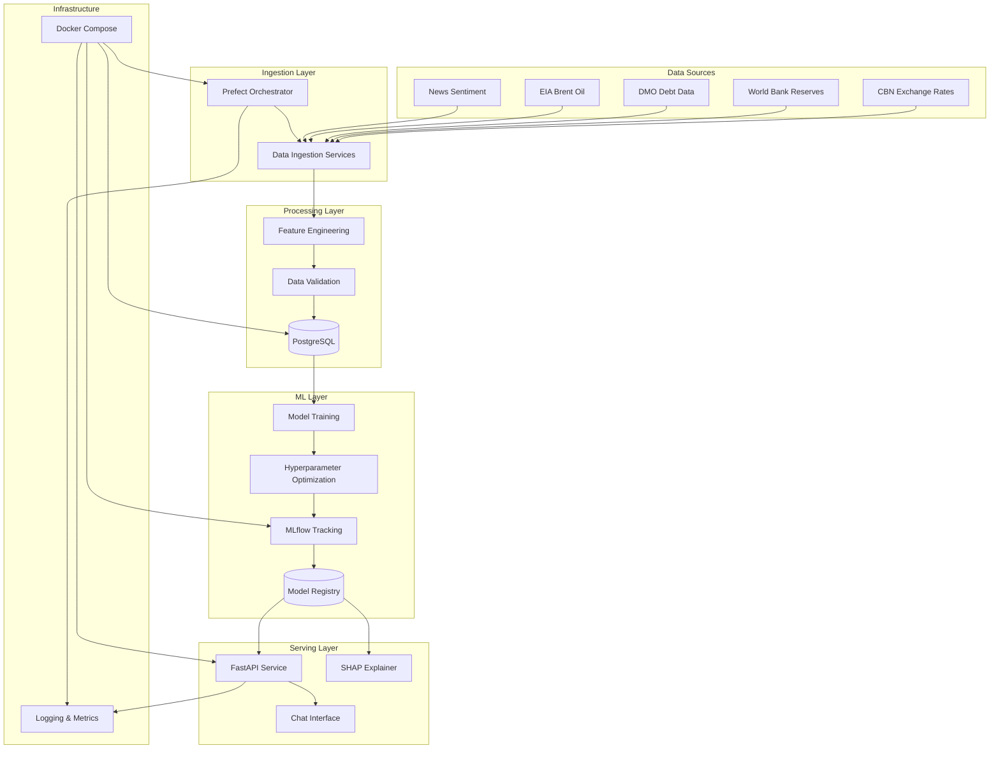

# NG FX Predictor

A production-ready Nigerian FX forecasting platform that ingests macroeconomic data daily, retrains ML models nightly, and serves USD/NGN exchange rate forecasts through REST APIs and chat interfaces.

## Architecture



## 🚀 Quick Start (15 minutes)

### Prerequisites

- Docker and Docker Compose
- Make (optional, for convenience commands)
- curl and jq (for testing)

### 1. Start the System

```bash
# Clone the repository
git clone https://github.com/ngfx/predictor.git
cd predictor

# Start the development environment
make dev_up

# Or manually with Docker Compose
docker-compose up -d postgres redis mlflow prefect
sleep 10
docker-compose up -d ngfx_api
```

### 2. Verify System Health

```bash
# Check system status
make status

# Or manually
curl http://localhost:8000/healthz | jq '.'
```

### 3. Make Your First Prediction

```bash
# Get 1-day prediction
make example_pred

# Or manually
curl -X POST "http://localhost:8000/predict?horizon=1" | jq '.'
```

### 4. Try the Chat Interface

```bash
# Ask for a forecast
curl -X POST "http://localhost:8000/chat" \
  -H "Content-Type: application/json" \
  -d '{"message": "What is the forecast for tomorrow?"}' | jq '.'
```

### 5. Get Prediction Explanations

```bash
# Get explanation for a specific date
curl "http://localhost:8000/explain?date=2024-01-15" | jq '.'
```

## 📊 Access Dashboards

Once the system is running, you can access:

- **API Documentation**: http://localhost:8000/docs
- **MLflow Tracking**: http://localhost:5000
- **Prefect Orchestration**: http://localhost:4200
- **Prometheus Metrics**: http://localhost:9090
- **Grafana Dashboard**: http://localhost:3000 (admin/admin)

## 🔧 Development

### Project Structure

```
ngfx-predictor/
├── src/ngfx_predictor/          # Main application code
│   ├── api/                     # FastAPI application
│   ├── config/                  # Configuration management
│   ├── data/                    # Data layer (sources, models)
│   ├── features/                # Feature engineering
│   ├── models/                  # ML models and training
│   ├── inference/               # Model inference
│   ├── orchestration/           # Prefect flows
│   ├── monitoring/              # Metrics and logging
│   └── utils/                   # Utilities
├── tests/                       # Test suites
├── scripts/                     # Deployment scripts
├── monitoring/                  # Monitoring configurations
├── docs/                        # Documentation
└── docker-compose.yaml          # Container orchestration
```

### Development Commands

```bash
# Start development environment
make dev_up

# Run tests
make test

# Code quality checks
make lint
make format

# CI pipeline
make ci

# View logs
make logs

# Stop environment
make dev_down
```

### Environment Configuration

Copy `env.example` to `.env` and customize:

```bash
cp env.example .env
# Edit .env with your settings
```

Key settings:
- `DATABASE_URL`: PostgreSQL connection
- `REDIS_URL`: Redis connection
- `MLFLOW_TRACKING_URI`: MLflow server
- `CBN_API_KEY`: CBN API key (optional)
- `EIA_API_KEY`: EIA API key (optional)

## 🤖 API Endpoints

### Prediction API

```bash
# Get prediction for 1-5 days
POST /predict?horizon=1

# Response
{
  "date": "2024-01-15",
  "horizon": 1,
  "usd_ngn": 1520.50,
  "pi80": [1490.89, 1550.11],
  "confidence": 0.8,
  "model_version": "v1.2.3"
}
```

### Explanation API

```bash
# Get SHAP explanations
GET /explain?date=2024-01-15

# Response
{
  "date": "2024-01-15",
  "top_features": [
    {"feature": "previous_rate", "contribution": 0.45, "direction": "positive"},
    {"feature": "oil_price", "contribution": 0.23, "direction": "positive"}
  ],
  "model_version": "v1.2.3"
}
```

### Chat Interface

```bash
# Natural language queries
POST /chat

# Examples
"What's the forecast for tomorrow?"
"Predict the exchange rate for next week"
"Why did the rate change?"
```

## 🧪 Testing

```bash
# Run all tests
make test

# Run specific test types
pytest tests/unit/
pytest tests/integration/

# With coverage
pytest --cov=src/ngfx_predictor --cov-report=html
```

## 📈 Monitoring

The system includes comprehensive monitoring:

### Metrics
- Request latency and throughput
- Data source health
- Model performance
- System resources

### Logging
- Structured JSON logging
- Request tracing
- Error tracking
- Audit logs

### Alerting
- Data staleness alerts
- Model performance degradation
- System health monitoring

## 🔐 Security

### Production Security Checklist

- [ ] Change default passwords
- [ ] Set proper CORS origins
- [ ] Configure TLS certificates
- [ ] Set up API rate limiting
- [ ] Configure firewall rules
- [ ] Enable security scanning
- [ ] Set up secret management

### Security Scanning

```bash
# Vulnerability scanning
make security_scan

# Container security
trivy image ngfx-predictor:latest
```

## 🚀 Deployment

### Single VM Deployment

```bash
# Production deployment
docker-compose -f docker-compose.yaml up -d

# With custom configuration
docker-compose -f docker-compose.yaml -f docker-compose.prod.yaml up -d
```

### Kubernetes Deployment

```bash
# Apply Kubernetes manifests
kubectl apply -f k8s/

# Or use Helm
helm install ngfx-predictor ./charts/ngfx-predictor
```

### VM Setup

See [docs/setup_vm.md](docs/setup_vm.md) for detailed VM configuration.

## 📚 Documentation

- [Architecture Overview](docs/architecture.md)
- [API Documentation](docs/api.md)
- [Development Guide](docs/development.md)
- [Deployment Guide](docs/deployment.md)
- [Contributing Guide](CONTRIBUTING.md)

## 🧩 Extending the System

### Adding New Data Sources

1. Create a new source class extending `BaseDataSource`
2. Implement `fetch()` and `fetch_async()` methods
3. Add configuration settings
4. Write tests with VCR.py cassettes

### Adding New Models

1. Create model trainer extending `ModelTrainer`
2. Implement training and inference logic
3. Add hyperparameter optimization
4. Register with MLflow

### Adding New Features

1. Implement feature engineering logic
2. Add feature validation
3. Update feature schema
4. Add feature tests

## 🛠️ Troubleshooting

### Common Issues

**Database Connection Error**
```bash
# Check database status
docker-compose logs postgres

# Recreate database
make clean && make dev_up
```

**API Not Starting**
```bash
# Check API logs
make logs

# Rebuild container
make build && make dev_up
```

**Data Source Failures**
```bash
# Check data source health
curl http://localhost:8000/data/status | jq '.'

# View detailed logs
docker-compose logs ngfx_api | grep -i "data source"
```

## 📊 Performance

### Benchmarks

- **Prediction latency**: < 100ms (p95)
- **Data ingestion**: 10,000 records/minute
- **Model training**: < 30 minutes
- **API throughput**: 1,000 requests/second

### Performance Testing

```bash
# Load testing
make perf_test

# Detailed benchmarking
ab -n 1000 -c 50 http://localhost:8000/predict?horizon=1
```

## 🤝 Contributing

We welcome contributions! Please see [CONTRIBUTING.md](CONTRIBUTING.md) for guidelines.

### Development Setup

```bash
# Install development dependencies
pip install -e ".[dev]"

# Set up pre-commit hooks
pre-commit install

# Run full CI pipeline
make ci
```

## 📝 License

This project is licensed under the MIT License - see the [LICENSE](LICENSE) file for details.

## 🙏 Acknowledgments

- Central Bank of Nigeria for exchange rate data
- World Bank for economic indicators
- EIA for oil price data
- Open source community for excellent tools

---

**Built with ❤️ for the Nigerian financial community**

For questions or support, please contact [team@ngfx.com](mailto:team@ngfx.com) 