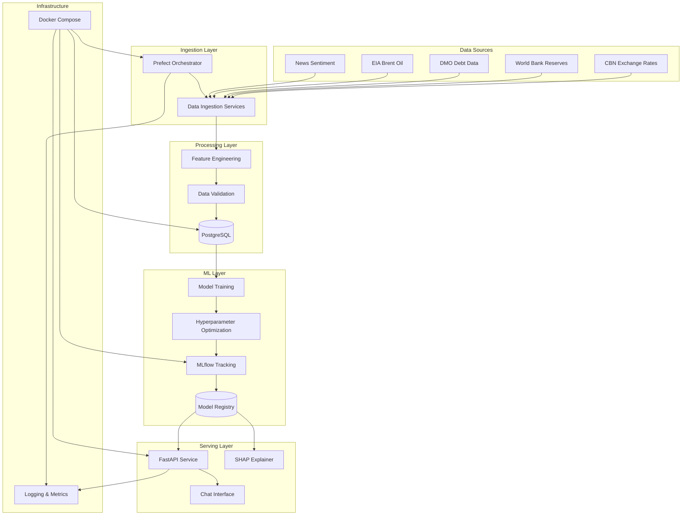

# Design Document

## Overview

The NG FX Predictor is architected as a microservices-based forecasting platform using a modern Python stack. The system follows a layered architecture with clear separation between data ingestion, feature engineering, model training, and serving layers. The design emphasizes containerization, observability, and maintainability while providing both REST API and conversational interfaces for accessing USD/NGN exchange rate forecasts.

## Architecture



## Components and Interfaces

### Data Ingestion Layer

**BaseDataSource Abstract Class**
- Interface: `fetch() -> pl.DataFrame`
- Responsibilities: Standardized data fetching with error handling and caching
- Implementations:
  - `CBNRatesSource`: Fetches official exchange rates from Central Bank of Nigeria
  - `WorldBankReservesSource`: Retrieves foreign reserve data
  - `DMODebtSource`: Processes debt management office PDF reports
  - `EIABrentSource`: Gets Brent crude oil prices
  - `NewsSentimentSource`: Analyzes financial news sentiment using FinBERT

**Data Validation**
- Schema validation using Pydantic models
- Data freshness checks (alerts if >7 days stale)
- Quality metrics (completeness, outlier detection)
- Graceful degradation when sources fail

### Feature Engineering Layer

**FeatureEngineer Class**
- Input: Raw DataFrames from multiple sources
- Output: Validated FeatureSet (Pydantic model)
- Features generated:
  - Rolling log returns (1-day, 5-day windows)
  - Days-since-last-update (freshness signals)
  - Regime flags (CB rate regime classification)
  - Sentiment buckets (negative/neutral/positive)
  - Technical indicators (moving averages, volatility)

**FeatureSet Schema (Pydantic)**
```python
class FeatureSet(BaseModel):
    date: datetime
    usd_ngn_rate: float
    log_return_1d: float
    log_return_5d: float
    days_since_update: int
    cb_regime: Literal["fixed", "managed_float", "flexible"]
    sentiment_score: Literal["negative", "neutral", "positive"]
    brent_oil_price: float
    foreign_reserves: float
    # Additional features...
```

### Model Training Layer

**ModelTrainer Class**
- Hyperparameter optimization using Optuna (10 trials per horizon)
- Separate models for each forecast horizon (T+1 to T+5)
- Base model: LightGBM for tabular performance
- Optional: PyTorch Temporal Fusion Transformer (flag-protected)
- Model export: ONNX and pickle formats
- Integration with MLflow for experiment tracking

**Training Pipeline**
1. Feature preparation and validation
2. Train/validation/test split (temporal)
3. Hyperparameter search per horizon
4. Model evaluation and selection
5. Champion model promotion
6. Model registration and versioning

### Serving Layer

**FastAPI Application**
- Async request handling
- Automatic OpenAPI documentation
- CORS configuration via environment variables
- Structured logging with request IDs

**API Endpoints**
- `POST /predict?horizon={1-5}`: Returns forecast with prediction intervals
- `GET /explain?date=YYYY-MM-DD`: SHAP explanations for specific predictions
- `POST /chat`: Natural language interface
- `GET /healthz`: Health check endpoint
- `GET /metrics`: Prometheus metrics (stub)

**Response Schemas**
```python
class ForecastResponse(BaseModel):
    date: str
    usd_ngn: float
    pi80: List[float]  # 80% prediction interval
    model_version: str
    confidence: float

class ExplanationResponse(BaseModel):
    date: str
    top_features: List[Dict[str, Union[str, float]]]
    model_version: str
```

### Chat Interface

**Pattern-Based NLP**
- Simple regex patterns for common queries
- Intent classification:
  - Forecast requests: "next week" → horizon=5
  - Explanation requests: "why" → /explain
  - Help requests: usage examples
- Fallback to API documentation for unrecognized patterns

### Orchestration Layer

**Prefect Flows**
- `daily_ingest_train`: Main orchestration flow
- Tasks:
  - `refresh_data`: Parallel data source ingestion
  - `feature_engineer`: Transform raw data to features
  - `train_models`: Train models for all horizons
  - `promote_champion`: Update production models
- Scheduling: Cron `0 2 * * *` (2 AM Abuja time)
- Error handling: Retry policies and alerting

## Data Models

### Database Schema (PostgreSQL)

**raw_data table**
```sql
CREATE TABLE raw_data (
    id SERIAL PRIMARY KEY,
    source VARCHAR(50) NOT NULL,
    date DATE NOT NULL,
    data JSONB NOT NULL,
    ingested_at TIMESTAMP DEFAULT NOW(),
    UNIQUE(source, date)
);
```

**features table**
```sql
CREATE TABLE features (
    id SERIAL PRIMARY KEY,
    date DATE NOT NULL UNIQUE,
    feature_vector JSONB NOT NULL,
    created_at TIMESTAMP DEFAULT NOW()
);
```

**predictions table**
```sql
CREATE TABLE predictions (
    id SERIAL PRIMARY KEY,
    date DATE NOT NULL,
    horizon INTEGER NOT NULL,
    predicted_rate FLOAT NOT NULL,
    pi_lower FLOAT NOT NULL,
    pi_upper FLOAT NOT NULL,
    model_version VARCHAR(100) NOT NULL,
    created_at TIMESTAMP DEFAULT NOW(),
    UNIQUE(date, horizon)
);
```

### MLflow Model Registry

**Model Metadata**
- Model name: `ngfx-predictor-h{horizon}`
- Stages: `Staging`, `Production`, `Archived`
- Tags: `horizon`, `algorithm`, `performance_metrics`
- Artifacts: ONNX model, pickle model, feature schema

## Error Handling

### Data Ingestion Errors
- Source unavailable: Continue with available sources, log warning
- Data quality issues: Validate and flag problematic records
- Network timeouts: Exponential backoff retry (3 attempts)
- Rate limiting: Respect API limits with appropriate delays

### Model Training Errors
- Insufficient data: Require minimum 30 days of features
- Training failures: Retain previous champion model
- Hyperparameter search timeout: Use default parameters
- Model performance degradation: Alert and investigate

### Serving Errors
- Model not found: Return HTTP 503 with retry-after header
- Invalid input: Return HTTP 400 with validation details
- Prediction failures: Return HTTP 500 with error ID for tracking
- Rate limiting: HTTP 429 with appropriate headers

### Monitoring and Alerting
- Structured logging with correlation IDs
- Error rate thresholds trigger alerts
- Model performance drift detection
- Data freshness monitoring

## Testing Strategy

### Unit Testing
- Each data source with VCR.py cassettes for offline testing
- Feature engineering with known input/output pairs
- Model training with synthetic data
- API endpoints with mocked dependencies
- Target: >80% code coverage

### Integration Testing
- End-to-end pipeline with Testcontainers
- Docker Compose stack validation
- API integration with real model artifacts
- Database integration with test fixtures

### Property-Based Testing
- Hypothesis strategies for numeric features
- Edge case generation for date ranges
- Input validation boundary testing
- Model prediction consistency checks

### Performance Testing
- API response time benchmarks
- Model inference latency
- Data ingestion throughput
- Memory usage profiling

### Test Data Management
- Miniature 3-day CSV fixtures for each data source
- Synthetic feature sets for model testing
- Known-good prediction examples
- Error scenario test cases

## Security Considerations

### Secrets Management
- Environment variable configuration
- `.env.example` template with secure defaults
- No secrets in version control
- Docker secrets for production deployment

### API Security
- CORS configuration via `CORS_ORIGIN` environment variable
- Request rate limiting
- Input validation and sanitization
- Error message sanitization (no sensitive data leakage)

### Container Security
- Trivy vulnerability scanning in CI/CD
- Non-root container execution
- Minimal base images
- Regular dependency updates

### Data Privacy
- No PII in logs or metrics
- Secure data transmission (HTTPS in production)
- Data retention policies
- Audit logging for sensitive operations

## Deployment Architecture

### Single VM Deployment
- Docker Compose orchestration
- Local file system for MLflow artifacts
- PostgreSQL container for metadata
- Nginx reverse proxy (optional)
- Resource requirements: 8GB RAM, 4 CPU cores

### Kubernetes Scaling (Future)
- Helm charts for deployment
- Persistent volumes for model artifacts
- Horizontal pod autoscaling
- Service mesh for inter-service communication
- External PostgreSQL (managed service)

## Performance Considerations

### Model Inference
- ONNX runtime for fast inference
- Model caching in memory
- Batch prediction capabilities
- Async request processing

### Data Processing
- Polars for efficient DataFrame operations
- Parallel data source ingestion
- Incremental feature computation
- Database connection pooling

### Resource Optimization
- Memory-efficient data structures
- Lazy evaluation where possible
- Garbage collection tuning
- Container resource limits